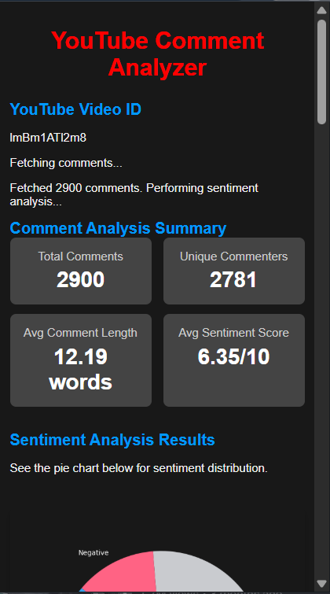
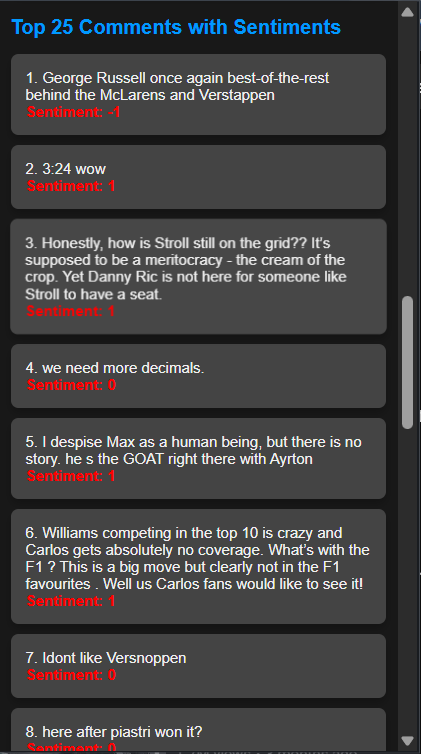
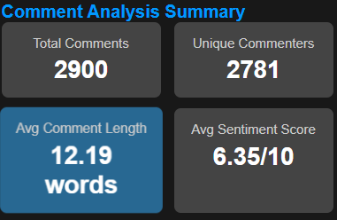
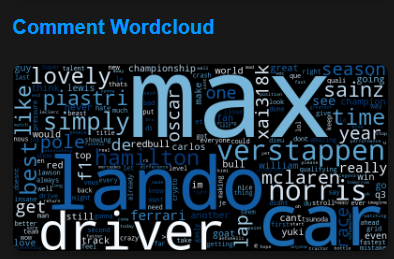
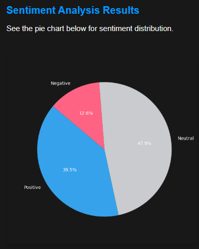

Of course!  
Here’s the full **ready-to-copy** `README.md` file for your project — correctly formatted with no extra backticks around it, professional structure, and markdown standards ✅:

---

# 📄 README.md

# YouTube Comment Analyzer - Chrome Extension

A minimal and elegant Chrome Extension that analyzes YouTube video comments with a stylish dark theme interface.  
This extension allows users to easily view comment metrics, sentiment analysis, and visually enhanced comment lists — all within a YouTube video page.

---

## 🚀 Features

- 📋 **List and display** YouTube comments dynamically
- 🎨 **Dark theme** with a sleek YouTube-style vibe
- 📈 **Display metrics** like total comments, positive/negative sentiment count
- 🧠 **Sentiment highlights** for comments
- ⚡ **Fast and lightweight** Chrome Extension
- 🔥 **Animated hover effects** for a rich UX
- 🎬 **YouTube-themed design** with colors and icons

---

## 📂 Project Structure

```
├── popup.html        # The main popup layout (UI)
├── popup.css         # Styling for dark theme + YouTube vibe
├── popup.js          # Logic to dynamically fetch and render comments
├── manifest.json     # Chrome extension manifest
├── assets/           # Images and icons (if any)
```

---

## 🛠️ How to Install Locally

1. Clone this repository:
   ```bash
   git clone https://github.com/Prayesh13/Yt-chrome-plugin-frontend.git
   ```
2. Open **Google Chrome**.
3. Navigate to: `chrome://extensions/`
4. Enable **Developer Mode** (toggle switch in top right).
5. Click **Load Unpacked**.
6. Select the cloned `Yt-chrome-plugin-frontend` directory.
7. The YouTube Comment Analyzer extension should now appear!

---

## 📸 Screenshots

### 🔹 Popup User Interface


---

### 🔹 Comment List with Sentiment



---

### 🔹 Metrics Display (Total Comments, Sentiment Analysis)





---

## 🌐 Built With

- **HTML5**
- **CSS3** (with dark theme enhancements)
- **Vanilla JavaScript**
- **Chrome Extensions API**

---

## ✨ Future Improvements

- Integrate **real-time sentiment analysis** using machine learning APIs
- Add **sorting and filtering** options (e.g., by sentiment, likes)
- Enable **comment downloading/exporting** feature
- Optimize for **better mobile responsiveness**

---

## 🤝 Contributing

Pull requests are welcome!  
For major changes, please open an issue first to discuss what you would like to change.

---

## 📄 License

This project is licensed under the **MIT License**.

---

## 📬 Contact

**Prayesh**  
- [GitHub Profile](https://github.com/Prayesh13)

---

# 📚 References

- [Chrome Extensions Getting Started Guide](https://developer.chrome.com/docs/extensions/mv3/getstarted/)
